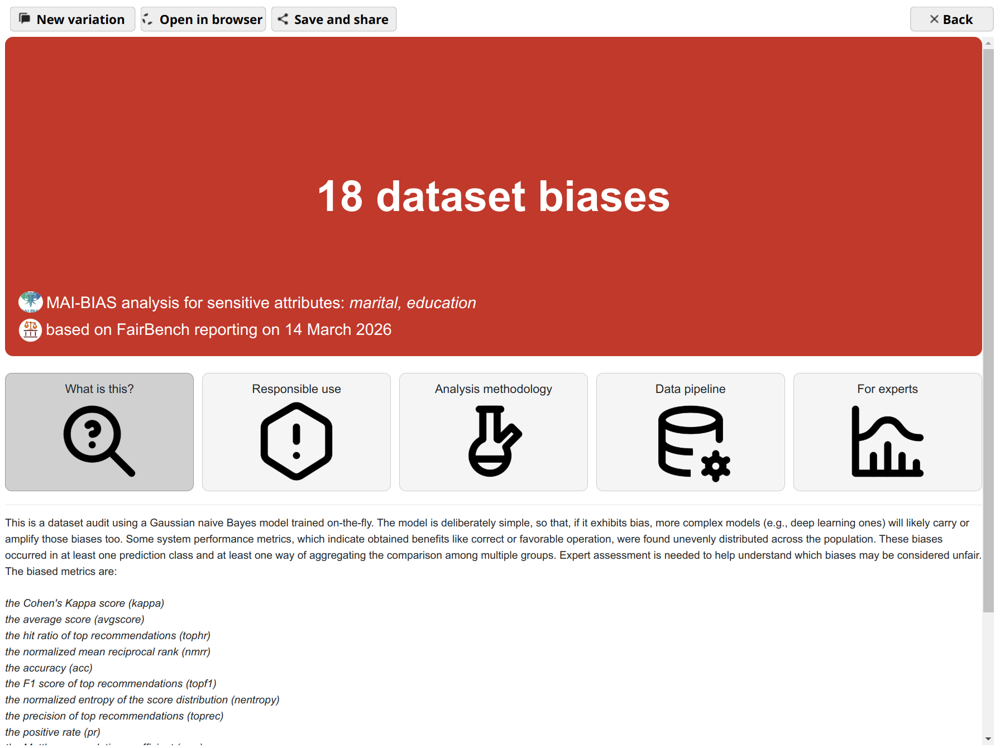

 # MAI-BIAS modules
 
[](https://mammoth-eu.github.io/mammoth-commons/index.html)
[](https://github.com/mammoth-eu/mammoth-commons/actions/workflows/integration.yml)

[](code_of_conduct.md)
[](https://pepy.tech/projects/mai-bias)

*Quickly develop and locally run MAI-BIAS toolkit modules.*

This repository is created by the [MAMMOth](https://mammoth-ai.eu/)
project and holds the mammoth-commons library, which contains 
supporting datatypes and decorators for developing fairness modules.
It also hosts a catalogue of 35+ modules. 
Finally, find desktop and terminal applications that 
run those modules in your local machine.


## 🔬 Run locally

1. Make **sure** you are on Python 3.11. Most modules also work in Python 3.13, with the exception of text debiasing.
2. Install the *mai-bias* package.
3. Launch the desktop app.

```bash
# may need to replace python with python3
python --version
pip install mai-bias
python -m mai_bias.app
```

You can try this boostrapping command:

```bash
curl -fsSL https://raw.githubusercontent.com/mammoth-eu/mammoth-commons/dev/mai_bias.sh -o mai_bias.sh && chmod +x mai_bias.sh && ./mai_bias.sh
```

Modules will install further missing dependencies they need to run. **This may take some time, especially for modules depending on torch or tensorflow.**




<details><summary>Ubuntu: Example of full installation pipeline</summary>

```bash
sudo add-apt-repository ppa:deadsnakes/ppa -y
sudo apt update
sudo apt install python3.13
sudo apt install python3.13-pip
sudo apt install python3.13-venv
python3 -m venv venv
source venv/bin/activate
python3 install mai-bias
python3 -m mai_bias.app
```
</details>

<details><summary>Windows: WSL missing .so files</summary>
    
If you are in WSL, you are likely to get errors like this *ImportError: libGL.so.1: cannot open shared object file: No such file or directory*.
This is due to the lack of a graphical environment. Install one like like below, including missing font symbols needed to properly display certain UI element.

```bash
sudo apt update
sudo apt install fonts-noto-color-emoji fonts-symbola
sudo apt install libgl1
sudo apt install libxkbcommon-x11-0
sudo apt install libegl1
sudo apt install libnss3
sudo apt install libxcomposite1
sudo apt install libxdamage1
sudo apt install libxrender1
sudo apt install libxrandr2
sudo apt install libxtst6
sudo apt install libxi6
sudo apt install libasound2
sudo apt install libxkbfile-dev
sudo apt install --reinstall qt6-wayland libxcb-cursor0 libxkbcommon-x11-0
sudo apt install libx11-xcb1 libxcb-xinerama0 libxcb-cursor0
```

</details>


<details><summary>The app never opens</summary>

First time, it needs to hypdrate itself with some images. 
If it crashes nonetheless, there could be an issue with
GPU acceleration in your environment. Try starting the 
app with the following command
as a first remedy (after making a virtual environment as
described above, if not there).

```bash
python -m mai_bias.app_safe
```

</details>

<details><summary>MAC: Illegal hardware instruction</summary> 

We have encountered this error in at least one M2 machine.
This is likely due to a mismatch between Python's x86-x64 vs arm64e
choice. Please make sure that you have a matching architecture
between the system and python. Ideally install the latter
through *brew*.

</details>

<details><summary>VSCode launch profile</summary>  

```json 
{
    "version": "0.2.0",
    "configurations": [
        {
            "name": "Python Debugger: Current File",
            "type": "debugpy",
            "request": "launch",
            "program": "${file}",
            "console": "integratedTerminal",
            "justMyCode": false,
            "cwd": "${workspaceFolder}",
        },
        {
            "name": "Python: Test",
            "type": "debugpy",
            "request": "launch",
            "program": "${file}",
            "console": "integratedTerminal",
            "justMyCode": false,
            "cwd": "${workspaceFolder}",
            "env": {
                "PYTHONPATH": "${workspaceFolder}"
            }
        },
        {
            "name": "MAI-BIAS Desktop",
            "type": "debugpy",
            "request": "launch",
            "module": "mai_bias.app",
            "justMyCode": false
        },
        {
            "name": "MAI-BIAS Terminal",
            "type": "debugpy",
            "request": "launch",
            "module": "mai_bias.cli",
            "justMyCode": false
        }
    ]
}
``` 
</details>

## 🖥️ [Run in terminal](README_terminal.md)
 
## ☁️ [Deploy in a server](https://github.com/mammoth-eu/mammoth-toolkit-releases)

## 🦣 [Website](https://mammoth-eu.github.io/mammoth-commons/)

## 👍 [Contribute](CONTRIBUTING.md)


## License

This repository is distributed under the Apache 2.0 License, Copyright 2026 MAMMOth.

Third-party licenses:

- Some of the icons in `docs/icons/` are used by modules and
and are released by *tabler-icons* under the MIT license 
here: https://github.com/tabler/tabler-icons

- The file `mammoth_commons/custom_kfp.py` was adjusted from the KFP project to
handle additional metadata needed for interoperability with the demonstrator 
and our metaprogramming decorators. Modifications were made on an original 
version that is released under Apache 2.0 License under the KFP project here: 
https://github.com/kubeflow/pipelines
